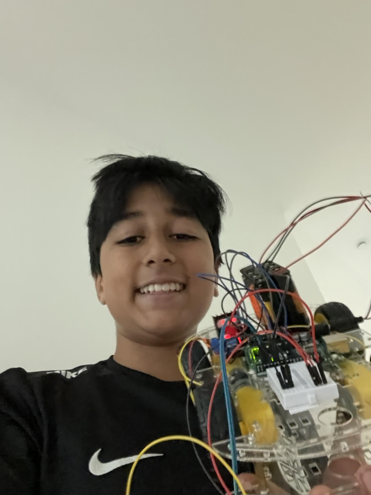
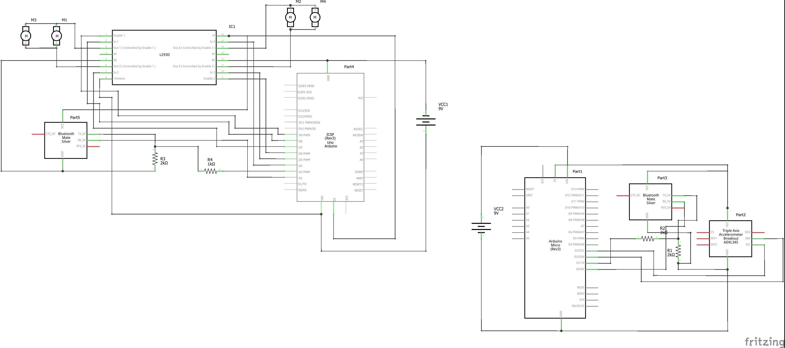

# Gesture Controlled Rover
My project is the Gesture Controlled Rover that uses an accelerometer to determnine the movements of the rover. It works by communicating wirelessly the values from the accelerometer to the main aurdiono board and for my modification I choose to... .While I struggled to connect wires and pair bluetooth modules, I still completed my project and gained new knowledge regarding engineering.

| **Engineer** | **School** | **Area of Interest** | **Grade** |
|:--:|:--:|:--:|:--:|
| Devan G | Marin Academy | Electrical Engineering | Incoming Freshman



  
# Final Milestone


<iframe width="560" height="315" src="https://www.youtube.com/embed/F7M7imOVGug" title="YouTube video player" frameborder="0" allow="accelerometer; autoplay; clipboard-write; encrypted-media; gyroscope; picture-in-picture; web-share" allowfullscreen></iframe>

For your final milestone, explain the outcome of your project. Key details to include are:
- What you've accomplished since your previous milestone
- What your biggest challenges and triumphs were at BSE
- A summary of key topics you learned about
- What you hope to learn in the future after everything you've learned at BSE


# Second Milestone

<iframe width="560" height="315" src="https://www.youtube.com/embed/cA4MnJ2BhBE" title="Bluestamp Milestone 2" frameborder="0" allow="accelerometer; autoplay; clipboard-write; encrypted-media; gyroscope; picture-in-picture; web-share" allowfullscreen></iframe>

- My second milestone saw me creating a controller to controll my car.
- The way this will work is using an accelerometer, bluetooth chip, and arduino micro to communicate with my arduino uno connected to my car.
- I have not fully completed the controller because I have not added an accelerometer
- I struggled with pairing the two bluetooth modules as you needed one for the arduino micro and one for the arduino uno but I eventually realized that I had bad wiring and I needed to unplug certain wires in the pairing proccess for it to work.
- I am suprised on how well my project is working because in the past it has taken me much longer to create my projects. My final milestone will be my modifications and the accelerometer

# First Milestone


<iframe width="560" height="315" src="https://www.youtube.com/embed/nzAVfoaRZ_Q" title="BlueStamp Milestone 1" frameborder="0" allow="accelerometer; autoplay; clipboard-write; encrypted-media; gyroscope; picture-in-picture; web-share" allowfullscreen></iframe>

- My first Milestone entailed the building of the rover.
- While assembling the chassis, I forgot to read all of the instructions which lead to me having to take apart part of the rover and rebuilding it the right way.
- When I was wiring it, I struggled with connecting the wires.
- In the end, I just needed to unscrew the screws on the top of the terminals on the motor board and tighten them once the wires were in.
- The motor board is essentialy the middle man between the Arduino and the motors. It calculates the polarity and regulates the power to the motors.
- After, I wired my Arduino to the motor board and used some source code from [here](https://create.arduino.cc/editor/sunfounder01/6ff67dfb-a1c1-474b-a106-6acbb3a39e6f/preview)) to get my rover moving.
- In the future, I will power it with batteries and use an acceleromater to controll the rover.

# Schematics 



# Code
Here is the code for my car without any modifications. (Arduino Uno)

```c++
//Code for the car
// This is to receive data from the other bluetooth module and read the gestures
// The robot should move accordingly! 

#include <SoftwareSerial.h>

#define tx 2
#define rx 3

SoftwareSerial configBt(rx, tx);

//character variable for command
char c = "";

//start at 50% duty cycle
//int s = 120;

//change based on motor pins
int in1 = 5;
int in2 = 6;
int in3 = 9;
int in4 = 10;

void setup()
{
  //opens serial monitor and bluetooth serial monitor
  Serial.begin(38400);
  configBt.begin(38400);
  pinMode(tx, OUTPUT);
  pinMode(rx, INPUT);

  //initializes all motor pins as outputs
  pinMode(in1, OUTPUT);
  pinMode(in2, OUTPUT);
  pinMode(in3, OUTPUT);
  pinMode(in4, OUTPUT);
}

void loop()
{
  //checks for bluetooth data
  if (configBt.available()){
    //if available stores to command character
    c = (char)configBt.read();
    //prints to serial
    Serial.println(c);
  }

  //acts based on character
  switch(c){
    
    //forward case
    case 'F':
      forward();
      break;
      
    //left case
    case 'L':
      left();
      break;
      
    //right case
    case 'R':
      right();
      break;
      
    //back case
    case 'B':
      back();
      break;
      
    //default is to stop robot
    case 'S':
      freeze();
    }
}

//moves robot forward 
void forward(){
  
    //chages directions of motors
    digitalWrite(in1, LOW);
    digitalWrite(in2, HIGH);
    digitalWrite(in3, HIGH);
    digitalWrite(in4, LOW);

  }

//moves robot left
void left(){

    //changes directions of motors
    digitalWrite(in1, LOW);
    digitalWrite(in2, HIGH);
    digitalWrite(in3, LOW);
    digitalWrite(in4, HIGH);

  }

//moves robot right
void right(){

    //changes directions of motors
    digitalWrite(in1, HIGH);
    digitalWrite(in2, LOW);
    digitalWrite(in3, HIGH);
    digitalWrite(in4, LOW);

  }

//moves robot backwards
void back(){

    //changes directions of motors
    digitalWrite(in1, HIGH);
    digitalWrite(in2, LOW);
    digitalWrite(in3, LOW);
    digitalWrite(in4, HIGH);

  }

//stops robot
void freeze(){

    //changes directions of motors
    digitalWrite(in1, LOW);
    digitalWrite(in2, LOW);
    digitalWrite(in3, LOW);
    digitalWrite(in4, LOW);

  }

```
And here is the code for the controller. (Arduino Micro)

```c++
#include <Wire.h>

#define MPU6050_ADDRESS 0x68

int16_t accelerometerX, accelerometerY, accelerometerZ;

void setup()
{
  Wire.begin();
  Serial1.begin(38400);

  // Initialize MPU6050
  Wire.beginTransmission(MPU6050_ADDRESS);
  Wire.write(0x6B);  // PWR_MGMT_1 register
  Wire.write(0);     // set to zero (wakes up the MPU6050)
  Wire.endTransmission(true);

  delay(100); // Delay to allow MPU6050 to stabilize
}

void loop()
{
  readAccelerometerData();
  determineGesture();
  delay(500);
}

void readAccelerometerData()
{
  Wire.beginTransmission(MPU6050_ADDRESS);
  Wire.write(0x3B);  // starting with register 0x3B (ACCEL_XOUT_H)
  Wire.endTransmission(false);
  Wire.requestFrom(MPU6050_ADDRESS, 6, true);  // request a total of 6 registers

  // read accelerometer data
  accelerometerX = Wire.read() << 8 | Wire.read();
  accelerometerY = Wire.read() << 8 | Wire.read();
  accelerometerZ = Wire.read() << 8 | Wire.read();
}

void determineGesture()
{
  if (accelerometerY >= 6500) {
    Serial1.write('F');
  }
  else if (accelerometerY <= -4000) {
    Serial1.write('B');
  }
  else if (accelerometerX <= -3250) {
    Serial1.write('L');
  }
  else if (accelerometerX >= 3250) {
    Serial1.write('R');
  }
  else {
    Serial1.write('S');
  }
}
```


# Bill of Materials
Here's where you'll list the parts in your project. To add more rows, just copy and paste the example rows below.
Don't forget to place the link of where to buy each component inside the quotation marks in the corresponding row after href =. Follow the guide [here]([url](https://www.markdownguide.org/extended-syntax/)) to learn how to customize this to your project needs. 

| **Part** | **Note** | **Price** | **Link** |
|:--:|:--:|:--:|:--:|
| Smart Car Kit | The body and motors of the car | $18.99 | <a href="https://www.amazon.com/gp/product/B06VTP8XBQ"> Link </a> |
| 2 Bluetooth Modules | Communication between Uno and Micro | $20.78 | <a href="https://www.amazon.com/HiLetgo-Wireless-Bluetooth-Transceiver-Arduino/dp/B071YJG8DR"> Link </a> |
| Item Name | What the item is used for | $Price | <a href="https://www.amazon.com/Arduino-A000066-ARDUINO-UNO-R3/dp/B008GRTSV6/"> Link </a> |
| Item Name | What the item is used for | $Price | <a href="https://www.amazon.com/Arduino-A000066-ARDUINO-UNO-R3/dp/B008GRTSV6/"> Link </a> |
| Item Name | What the item is used for | $Price | <a href="https://www.amazon.com/Arduino-A000066-ARDUINO-UNO-R3/dp/B008GRTSV6/"> Link </a> |
| Item Name | What the item is used for | $Price | <a href="https://www.amazon.com/Arduino-A000066-ARDUINO-UNO-R3/dp/B008GRTSV6/"> Link </a> |
| Item Name | What the item is used for | $Price | <a href="https://www.amazon.com/Arduino-A000066-ARDUINO-UNO-R3/dp/B008GRTSV6/"> Link </a> |
| Item Name | What the item is used for | $Price | <a href="https://www.amazon.com/Arduino-A000066-ARDUINO-UNO-R3/dp/B008GRTSV6/"> Link </a> |
| Item Name | What the item is used for | $Price | <a href="https://www.amazon.com/Arduino-A000066-ARDUINO-UNO-R3/dp/B008GRTSV6/"> Link </a> |
| Item Name | What the item is used for | $Price | <a href="https://www.amazon.com/Arduino-A000066-ARDUINO-UNO-R3/dp/B008GRTSV6/"> Link </a> |
| Item Name | What the item is used for | $Price | <a href="https://www.amazon.com/Arduino-A000066-ARDUINO-UNO-R3/dp/B008GRTSV6/"> Link </a> |

# Other Resources/Examples
One of the best parts about Github is that you can view how other people set up their own work. Here are some past BSE portfolios that are awesome examples. You can view how they set up their portfolio, and you can view their index.md files to understand how they implemented different portfolio components.
- [Example 1](https://trashytuber.github.io/YimingJiaBlueStamp/)
- [Example 2](https://sviatil0.github.io/Sviatoslav_BSE/)
- [Example 3](https://arneshkumar.github.io/arneshbluestamp/)

To watch the BSE tutorial on how to create a portfolio, click here. 
